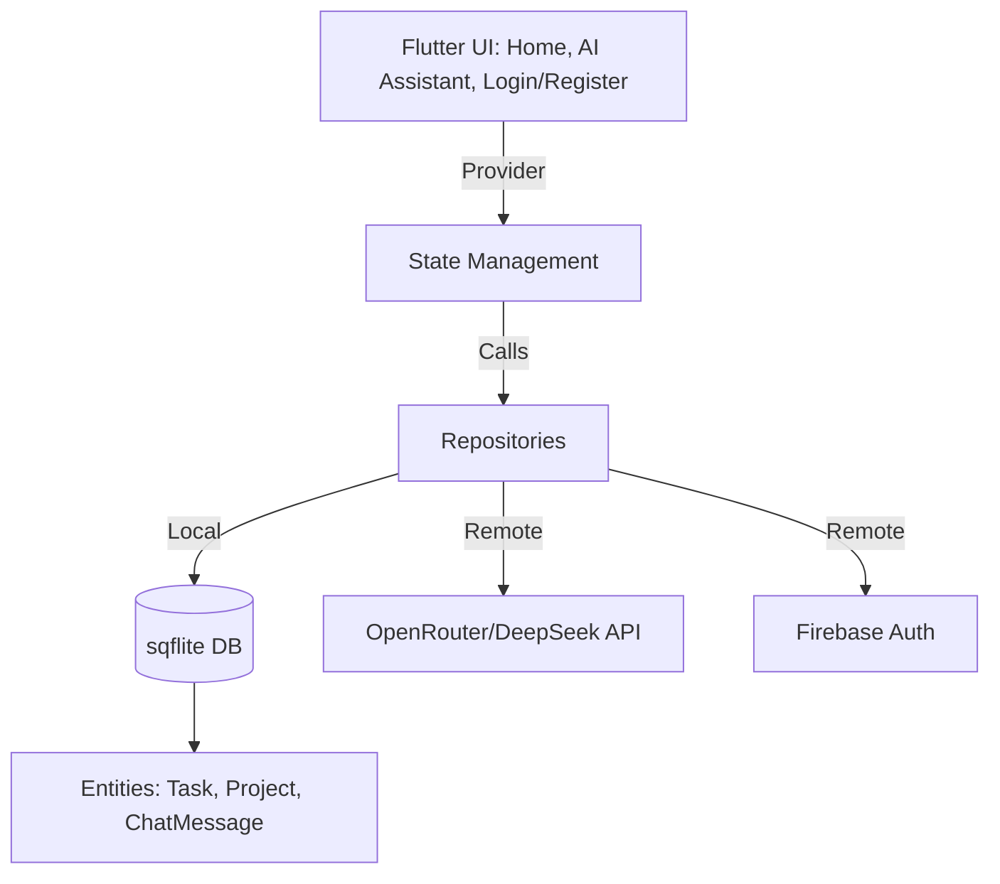
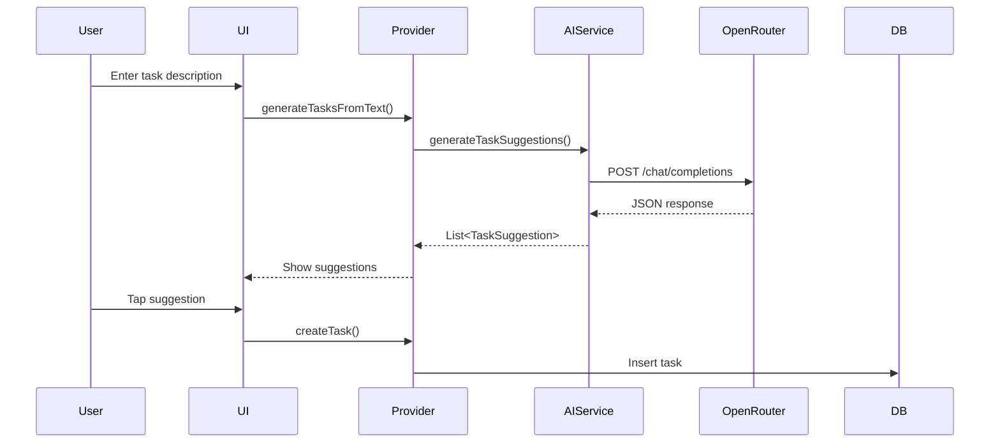

# Task Genius

Task Genius is a modern Flutter productivity app that leverages AI (OpenRouter/DeepSeek) and Firebase for authentication, with local persistence and a clean, customizable UI. It helps users manage tasks, get AI-powered suggestions, and keep their workflow organized.

---

## 🚀 Setup Instructions

1. **Clone the Repository**
   ```sh
   git clone https://github.com/Emmakade/taskgenius.git
   cd taskgenius
   ```

2. **Install Dependencies**
   ```sh
   flutter pub get
   ```

3. **Firebase Setup**
   - Add your `google-services.json` (Android) and `GoogleService-Info.plist` (iOS) to the respective folders.
   - Enable Email/Password authentication in Firebase Console.

4. **API Key Setup**
   - Create a `.env` file in the project root:
     ```env
     OPENROUTER_API_KEY=your_openrouter_api_key
     ```
   - Never commit your API key to version control.

5. **Run the App**
   ```sh
   flutter run
   ```

---

## 🏗️ Architecture Overview

- **State Management:** Provider
- **Data Layer:**
  - Repositories for tasks, projects, and chat
  - Local persistence via sqflite
  - Remote AI via OpenRouter/DeepSeek
- **Presentation Layer:**
  - Custom widgets for buttons, text fields, and task cards
  - Pages: Home, AI Assistant, Login/Register
- **Domain Layer:**
  - Entities: Task, Project, ChatMessage, TaskSuggestion
  - Use cases for business logic
- **Error Handling:**
  - Custom exceptions and error widgets
- **Chat/AI:**
  - Chat history persisted locally
  - AI suggestions parsed and actionable

---

## 📖 API Documentation

### AI Task Suggestion (OpenRouter/DeepSeek)
- **Endpoint:** `POST /chat/completions`
- **Headers:**
  - `Authorization: Bearer <API_KEY>`
  - `Content-Type: application/json`
- **Request Body Example:**
  ```json
  {
    "model": "deepseek/deepseek-r1:free",
    "messages": [
      {"role": "system", "content": "...instructions..."},
      {"role": "user", "content": "Describe my tasks..."}
    ]
  }
  ```
- **Response Example:**
  ```json
  {
    "choices": [
      {
        "message": {
          "content": "[{\"title\":\"Task 1\",\"description\":\"...\",\"priority\":\"high\",\"due_date\":\"2025-07-04\"}]"
        }
      }
    ]
  }
  ```
- **Parsing:**
  - The app parses the JSON string in `content` to extract task suggestions.

### Firebase Authentication
- Email/password sign-in and registration
- Secure user session management

### Local Database (sqflite)
- **Tables:**
  - `tasks`, `projects`, `chat_history`, `sync_status`
- **Entities:**
  - Task: id, title, description, due_date, priority, status, project_id, order, created_at, updated_at
  - Project: id, title, description, color, created_at, updated_at
  - ChatMessage: id, userMessage, aiResponses (JSON), timestamp

---

## 📱 Usage Examples

### 1. Register & Login
- Launch the app and register a new account or log in with your email/password.

### 2. Create a Task
- Tap the "+" button on the Home page.
- Fill in the task details and save.

### 3. Use the AI Assistant
- Tap the robot icon in the top right.
- Type a natural language description (e.g., "Plan my week with 3 work tasks and 2 personal errands").
- AI suggestions will appear as cards. Tap a card to add it to your task list.

### 4. Manage Tasks
- Tap a task to view details.
- Change status (To Do, In Progress, Completed) directly from the list.
- Reorder tasks with drag-and-drop.

### 5. Chat History
- All user queries and AI responses are saved and shown in the AI Assistant chat.
- Long-press a chat to delete it.

---

## 🗂️ Diagrams

### Architecture Diagram



### Data Flow Example



---

## 🔍 More Details

- **AI Suggestions:**
  - Handles both single and multiple task suggestions in JSON.
  - Robust parsing for Markdown/code block-wrapped JSON.
  - All AI responses are logged and saved in chat history.

- **Persistence:**
  - Chat history and tasks are stored locally for offline access.
  - Only the 10 most recent chats are shown for performance.

- **Extensibility:**
  - Add new providers, repositories, or widgets easily.
  - The architecture supports adding more AI models or integrations.

- **Security:**
  - API keys and sensitive data are never committed.
  - Use environment variables and secure storage for production.

- **Testing:**
  - Run `flutter test` to execute all unit and widget tests.
  - Integration tests can be added in the `test_driver/` directory.

---

## 📬 Feedback & Contributions

- Found a bug? Open an issue!
- Want to contribute? Fork the repo and submit a PR.
- Questions? Contact [dev Nuel](https://facebook.com/ogladeekay) or open a discussion.
